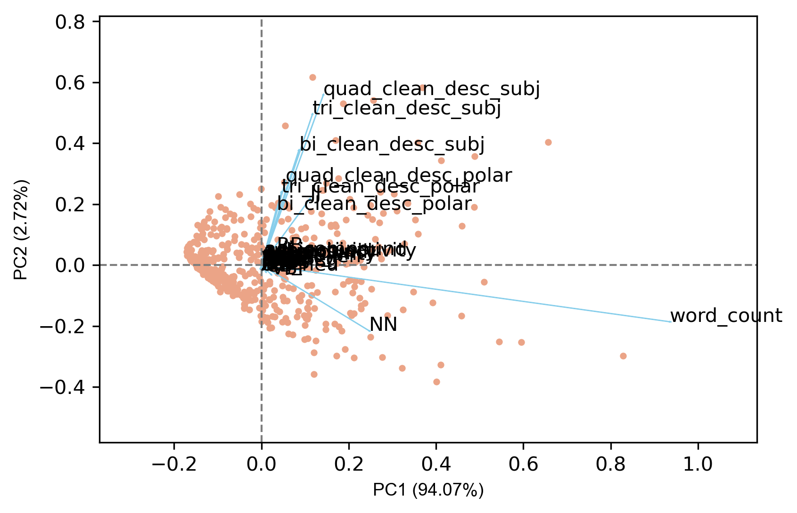
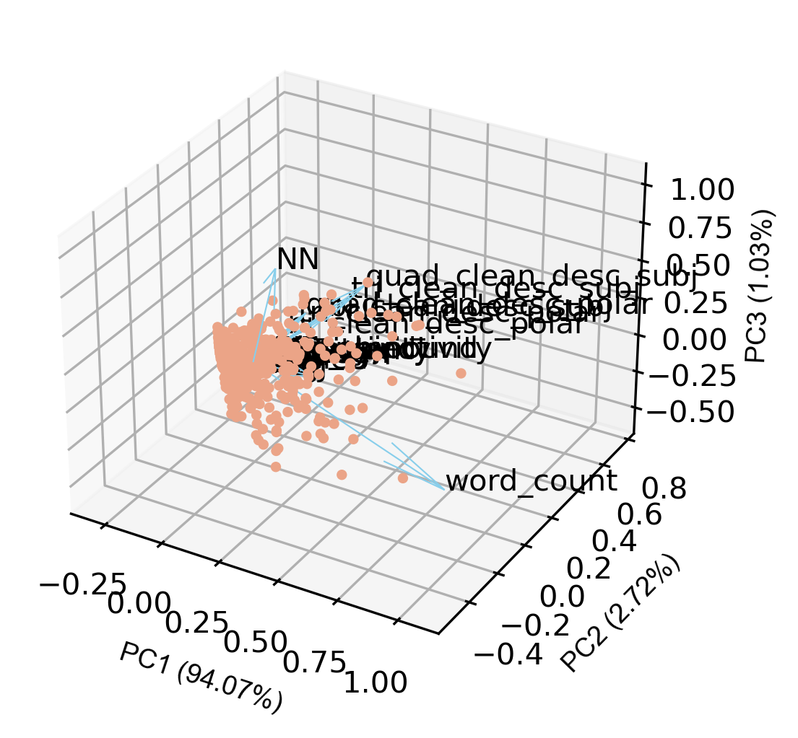
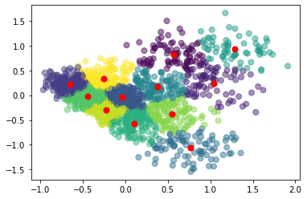

## Shark Tank Deal Prediction

### Introduction

Shark Tank is a television show that allows prospective companies to pitch to wealthy investors. 
How could we **predict** whether a deal be made or not based on the description? 

Unlike other basic prediction project with multiple categorical/numerical features, a description only contains list of words.
To make a prediction based on descriptions, we have to utilize the concept of _natural language processing_: 
  extract different features from the text.
Human languages are complicated, not only notions (symbols) pointing to either abstract or concrete existance, but also tense, emotions, grammars, and other aspects we even can't understand.
Without the usage of Deep-Learning, there's a hope we can capture some meanings within those choice of features and how important they are with respect to our ultimate question: **_Is a company going to win wealthy investors' favor?_**


### Data Cleaning/Pre-processing

#### EDA





#### Feature Engineering

##### Sentiment Analysis


##### PCA


### Visualizations


### Model Performance Analysis

For the model selection, we chose Support vector machine, Random Forest, and Logistic Regression to make the binary prediction. To learn how each model performs on the dataset, we first split the dataset into training and testing set. To avoid overfitting and model bias, we adopt the strategy of cross validation and calculated the mean of the overall scores. For hyperparameter tuning, we use grid search to find the parameters that produces the most accurate result. We applied these strategies for all three classifiers, and found that the overall performance of them are decent with the average accuracy being slightly above 0.5. Compared to SVM and Logistic Regression, Random Forest Classifier gives a worse prediction performance. For our final prediction, we decided to use Logistic Regression Classifiers because it has a F1 score of 0.56. For future improvements, we would consider trying more models such as lightbgm, etc.


### Conclusion


### Future Improvements
 
(possible word clustering)


You can use the [editor on GitHub](https://github.com/KULcoder/datahacks/edit/gh-pages/index.md) to maintain and preview the content for your website in Markdown files.

Whenever you commit to this repository, GitHub Pages will run [Jekyll](https://jekyllrb.com/) to rebuild the pages in your site, from the content in your Markdown files.

### Markdown

Markdown is a lightweight and easy-to-use syntax for styling your writing. It includes conventions for

```markdown
Syntax highlighted code block

# Header 1
## Header 2
### Header 3

- Bulleted
- List

1. Numbered
2. List

**Bold** and _Italic_ and `Code` text

[Link](url) and 
```

For more details see [Basic writing and formatting syntax](https://docs.github.com/en/github/writing-on-github/getting-started-with-writing-and-formatting-on-github/basic-writing-and-formatting-syntax).

### Jekyll Themes

Your Pages site will use the layout and styles from the Jekyll theme you have selected in your [repository settings](https://github.com/KULcoder/datahacks/settings/pages). The name of this theme is saved in the Jekyll `_config.yml` configuration file.

### Support or Contact

Having trouble with Pages? Check out our [documentation](https://docs.github.com/categories/github-pages-basics/) or [contact support](https://support.github.com/contact) and we’ll help you sort it out.
