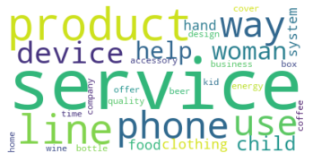
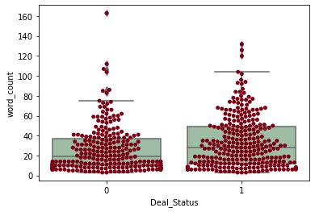
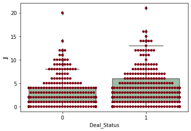
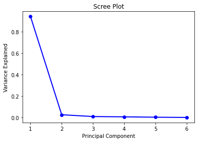
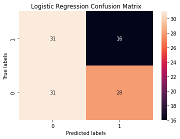
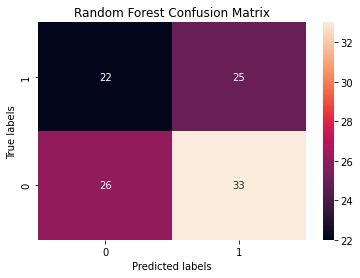
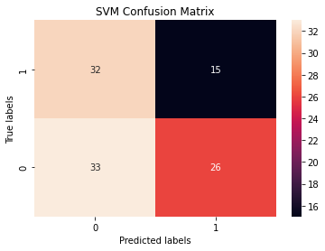

## Shark Tank Deal Prediction

### Introduction

Shark Tank is a television show that allows prospective companies to pitch to wealthy investors. 
How could we **predict** whether a deal be made or not based on the description? 

Unlike other basic prediction project with multiple categorical/numerical features, a description only contains list of words.
To make a prediction based on descriptions, we have to utilize the concept of _natural language processing_: 
  extract different features from the text.
Human languages are complicated, not only notions (symbols) pointing to either abstract or concrete existance, but also tense, emotions, grammars, and other aspects we even can't understand.
With the usage of machine learning, there's a hope we can capture some meanings within those choice of features and how important they are with respect to our ultimate question: **_Is a company going to win wealthy investors' favor?_**

### Data Cleaning/Pre-processing

#### Explotary Data Analysis
- Words with high tf-idf
- Most polar/subject words
- Anova
- Chi Square test theory
##### Frequency
- One of the easiest part to analysis natural language is by looking at word/phrase frequencies.

- Visual relationship of word counts and deal decision.               

  
- Possible Relationships between amount of Adjectives and deal decision.                             

#### Feature Engineering
Converting observations into features.

- Number of sentences
- Total number of words
- Total number of each word tag (noun, adj, adv etc.)
- Sentiment Analysis Scores                                                           
  With analysis on sentiments on words, analysis overall scores of one description.
- Unigram, Bigram, Trigram, Quadrigram                                                              
  Pharse with different length.
- Pos, Neu, Neg, Compound, Polarity, Subjectivity                                   
  More absract analysis on descriptions.
- Description category

#### PCA

For an efficient prediction based on our large amount of features, as showed we chosen the PCA decreased dimension to 3.

Result of PCA reduction vectors:

### Model Performance Analysis

For the model selection, we chose Support vector machine, Random Forest, and Logistic Regression to make the binary prediction. To learn how each model performs on the dataset, we first split the dataset into training and testing set. To avoid overfitting and model bias, we adopt the strategy of cross validation and calculated the mean of the overall scores. For hyperparameter tuning, we use grid search to find the parameters that produces the most accurate result. We applied these strategies for all three classifiers, and found that the overall performance of them are decent with the average accuracy being slightly above 0.5. Compared to SVM and Logistic Regression, Random Forest Classifier gives a worse prediction performance. For our final prediction, we decided to use Logistic Regression Classifiers because it has a F1 score of 0.56. For future improvements, we would consider trying more models such as lightbgm, etc.

 
(Logistic Regression Confusion Matrix)
 
(Random Forest Confusion Matrix)
 
(SVM Confusion Matrix)

### Conclusion

We believe that our model can be further enhanced with more time and resource. For future improvements, we will mostly be focusing on extracting and building more features that influences the label column. Due to time restriction, the predictive features that we built are general and coarse. In the future, we will be performing Chi-Squared test and Anova test to check whether each feature is independent or dependent on the label column. With more data set in the future, the model will be able to discover more subtle patterns in the description column. 

Another way to improve the performance is to try more classifers and use hyperparameter tuning to find the model that gives out the most accurate predictions. Specifically, we would use KNN classifer and use it as a baseline model for the prediction. Then, we would look at more complex model like lightbgm hoping to reach higher accuracy.

 
(possible word clustering)
- It's also possible for a larger set of descriptions, topic modeling can help increase accuracy.
